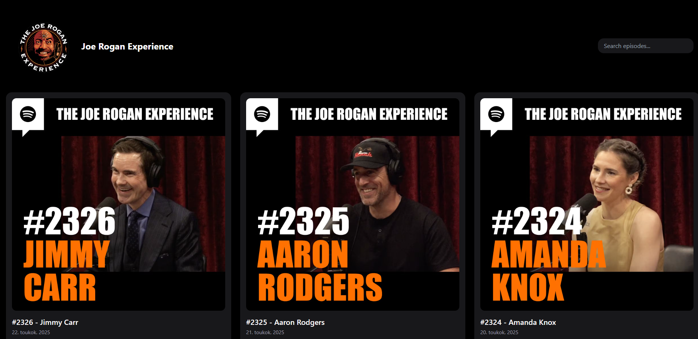
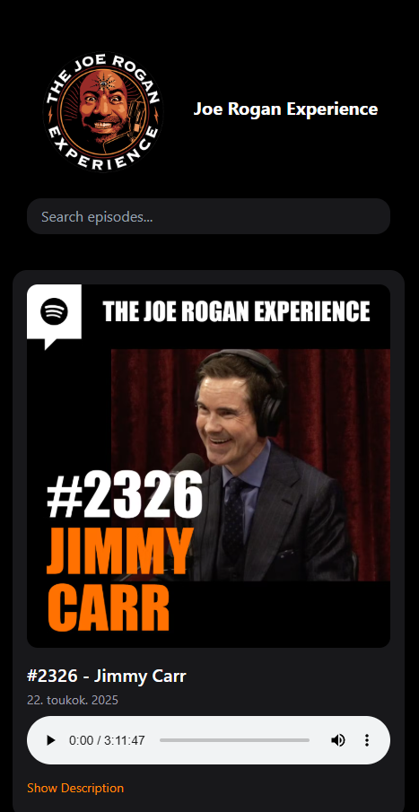

# WEBSITE LIVE: [PODSTATION-BROWSER](https://podstation-0xjulius.vercel.app/)

# 🎙️ Podcast Browser (Unofficial)
A fully serverless, responsive web app built with React, Tailwind CSS, and Vite that lets users search, stream, and explore episodes from the multiple RSS feeds.

This project uses a serverless function (API route) to proxy and parse XML podcast data, avoiding CORS issues without needing a dedicated backend. All episode data is fetched on-demand at runtime

🔍 Live search, lazy loading, animated UI with Framer Motion

🧰 Tech Stack:
⚛️ React + Tailwind CSS for the frontend UI

🔁 fetch + DOMParser to parse RSS feed data

🌐 Serverless API route (e.g., Vercel, Netlify Functions) for CORS-safe RSS fetching

🎧 Built-in HTML5 audio player

# Amazing responsivity for mobile devices!

